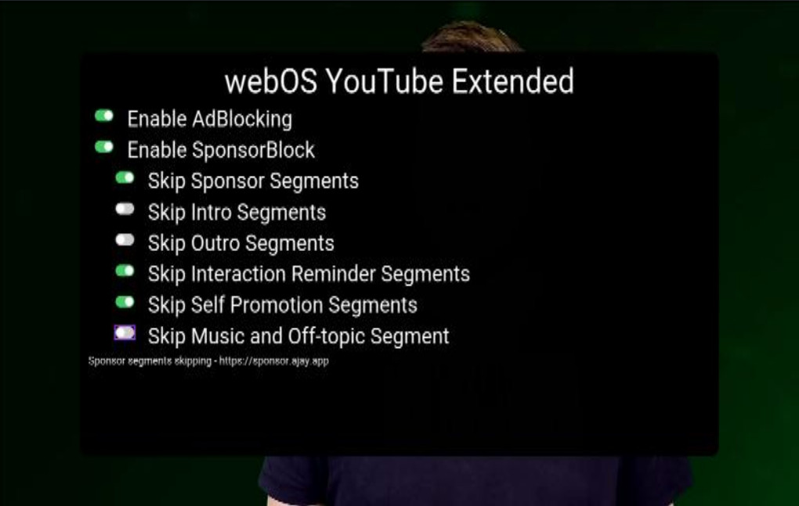

# youtube-webos-cobalt-app

## Fork

This application is a rework of https://github.com/webosbrew/youtube-webos to only use `div` tag.

The aim of this application is to be used on Cobalt browser which [only support a subset of HTML tags](https://cobalt.dev/development/reference/supported-features.html).

This repository https://github.com/webos-mouxon/youtube-webos-cobalt-browser provided a way to inject this web application into the official Youtube App.


## Presentation

YouTube App with extended functionalities




## Features

- Advertisements blocking
- [SponsorBlock](https://sponsor.ajay.app/) integration
- [Autostart](#autostart)

**Note:** Configuration screen can be opened by pressing 🟩 GREEN button on the remote.

## Pre-requisites

- Official YouTube app needs to be uninstalled before installation.

## Installation

- Use [webOS Homebrew Channel](https://github.com/webosbrew/webos-homebrew-channel) - app is published in official webosbrew repo
- Use [Device Manager app](https://github.com/webosbrew/dev-manager-desktop) - see [Releases](https://github.com/webosbrew/youtube-webos/releases) for a
  prebuilt `.ipk` binary file
- Use [webOS TV CLI tools](https://webostv.developer.lge.com/develop/tools/cli-installation) -
  `ares-install youtube...ipk` (For more information on configuring the webOS CLI tools, see [below](#development-tv-setup))

## Configuration

Configuration screen can be opened by pressing 🟩 GREEN button on the remote.

On a computer browser, char key `=` can be used on open it.

### Autostart

In order to autostart an application the following command needs to be executed
via SSH or Telnet:

```sh
luna-send-pub -n 1 'luna://com.webos.service.eim/addDevice' '{"appId":"youtube.leanback.v4","pigImage":"","mvpdIcon":""}'
```

This will make "YouTube AdFree" display as an eligible input application (next
to HDMI/Live TV, etc...), and, if it was the last selected input, it will be
automatically launched when turning on the TV.

This will also greatly increase startup performance, since it will be runnning
constantly in the background, at the cost of increased idle memory usage.
(so far, relatively unnoticable in normal usage)

In order to disable autostart run this:

```sh
luna-send-pub -n 1 'luna://com.webos.service.eim/deleteDevice' '{"appId":"youtube.leanback.v4"}'
```


## Building

- Clone the repository

```sh
git clone https://github.com/webos-mouxon/youtube-webos-cobalt-app.git
```

- Enter the folder and build the App, this will generate the `*.css` and `*.js` files in `output` directory.

```sh
cd youtube-webos-cobalt-app

# Install dependencies (need to do this only when updating local repository / package.json is changed)
npm install

npm run build && npm run package
```

### Production build

When providing a change on a pull request, build the `*.css` and `*.js` files with the following command:

```sh
npm run buildprod && npm run package
```

## Development TV setup

These instructions use the [webOS CLI tools](https://github.com/webos-tools/cli).
See <https://webostv.developer.lge.com/develop/tools/cli-introduction> for more information.

### Configuring webOS CLI tools with Developer Mode App

This is partially based on <https://webostv.developer.lge.com/develop/getting-started/developer-mode-app>.

- Install Developer Mode app from Content Store
- Enable Developer Mode
- Enable key server and download TV's private key: `http://TV_IP:9991/webos_rsa`  
  The key must be saved under `~/.ssh` (or `%USERPROFILE%\.ssh` on Windows)
- Configure the device using `ares-setup-device` (`-a` may need to be replaced with `-m` if device named `webos` is already configured)
  - `PASSPHRASE` is the 6-character passphrase printed on screen in developer mode app
  - `privatekey` path is relative to `${HOME}/.ssh` (Windows: `%USERPROFILE%\.ssh`)

```sh
ares-setup-device -a webos -i "username=prisoner" -i "privatekey=webos_rsa" -i "passphrase=PASSPHRASE" -i "host=TV_IP" -i "port=9922"
```

### Configuring webOS CLI tools with Homebrew Channel / root

- Enable SSH in Homebrew Channel app
- Generate SSH key on developer machine (`ssh-keygen -t rsa`)
- Copy the private key (`id_rsa`) to the `~/.ssh` directory (or `%USERPROFILE%\.ssh` on Windows) on the local computer
- Append the public key (`id_rsa.pub`) to the `/home/root/.ssh/authorized_keys` file on the TV
- Configure the device using `ares-setup-device` (`-a` may need to be replaced with `-m` if device named `webos` is already configured)
  - `privatekey` path is relative to `${HOME}/.ssh` (Windows: `%USERPROFILE%\.ssh`)

```sh
ares-setup-device -a webos -i "username=root" -i "privatekey=id_rsa" -i "passphrase=SSH_KEY_PASSPHRASE" -i "host=TV_IP" -i "port=22"
```

## Installation

```sh
npm run deploy
```

## Launching

- The app will be available in the TV's app list. You can also launch it using the webOS CLI tools.

```sh
npm run launch
```

To jump immediately into some specific video use:

```sh
npm run launch -- -p '{"contentTarget":"v=F8PGWLvn1mQ"}'
```
